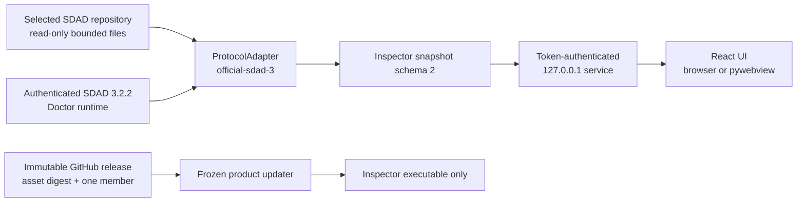

> **Languages:** **English** | [한국어](README.ko.md)

# SDAD Inspector

[](https://github.com/LiveTrack-X/sdad-inspector/actions/workflows/cross-platform.yml)
[](https://github.com/LiveTrack-X/sdad-inspector/releases/latest)

SDAD Inspector is a local desktop viewer for understanding the current state of
an SDAD repository without hunting through control files by hand. Select a
repository and it puts navigation and document status on the left, the active
packet and exact current work in the center, and provenance for the selected
value on the right.

The inspected repository is **read-only**. Inspector does not run its declared
validation commands and does not edit source, SPEC, state, TODO, or findings
files. Only the Inspector product updater writes to Inspector-owned app data and
the portable executable being updated.

> **0.0.2 is a regular GitHub Release, but remains unsigned.** It is not an
> installer and has no code signing or notarization. Your operating system may
> warn or block it. Verify `SHA256SUMS` before running it. If your organization
> does not allow unsigned software, do not bypass that policy; use the source
> workflow instead.

## Start in three minutes

You do not need to install Python or Node.js on the destination computer. Every
archive contains exactly one **single portable executable** with the runtime,
UI, and authenticated SDAD 3.2.2 engine embedded.

1. Open the [`v0.0.2` release](https://github.com/LiveTrack-X/sdad-inspector/releases/tag/v0.0.2).
2. Download the archive for your machine and `SHA256SUMS`.
3. Verify the archive hash using the command below.
4. Extract and run the only executable in the archive.
5. Choose a project root containing `sdad-state.yaml`.

| Computer | Download | Executable inside |
| --- | --- | --- |
| Windows x64 | `SDAD-Inspector-0.0.2-windows-x64.zip` | `SDAD-Inspector.exe` |
| macOS Apple Silicon | `SDAD-Inspector-0.0.2-macos-arm64.tar.gz` | `SDAD-Inspector` |
| Linux x64 | `SDAD-Inspector-0.0.2-linux-x64.tar.gz` | `SDAD-Inspector` |

Do not assume that an architecture missing from this table, such as Intel macOS,
is covered by the published evidence. Source execution may work, but that is not
the same claim as a released and smoke-tested portable asset.

### Verify the archive

Windows PowerShell, with the archive and `SHA256SUMS` in the same folder:

```powershell
$archive = Get-Item .\SDAD-Inspector-0.0.2-windows-x64.zip
$expected = (Select-String .\SHA256SUMS -Pattern $archive.Name).Line.Split()[0]
$actual = (Get-FileHash $archive -Algorithm SHA256).Hash.ToLower()
$actual -eq $expected
```

The final result must be `True`.

macOS:

```bash
grep 'macos-arm64' SHA256SUMS | shasum -a 256 -c -
```

Linux:

```bash
grep 'linux-x64' SHA256SUMS | sha256sum -c -
```

If macOS or Linux reports that the extracted file is not executable, add
permission to that file only:

```bash
chmod +x ./SDAD-Inspector
./SDAD-Inspector /path/to/your-project
```

On Windows, double-click the EXE or pass a project path explicitly:

```powershell
.\SDAD-Inspector.exe "C:\path\to\your-project"
```

## Reading the interface


*This public screenshot uses a synthetic SDAD 3.2.2 fixture with no personal
paths or private operating documents. Use the language menu in the upper-right
corner to switch between English and 한국어, and the moon icon to change theme.*

The one-line banner at the top of this README is repository introduction art.
It is intentionally absent from the app Overview, which starts directly with
the active packet and repository evidence.

- **Command bar** — shows the project and bundled engine, and provides Manual or
  AUTO 15s refresh, reveal-in-folder, path copy, language, and theme controls.
- **Repository pane** — opens state, active SPEC, active packet, TODO,
  development flow, Rule 5 proposal, routed documents, and findings.
- **Work area** — brings together the packet objective and status, remaining and
  completed TODOs, observed changed paths, recent commits, and handoffs.
- **Development flow** — shows the official
  `Plan → Route → Implement → Verify → Report` loop and keeps owner gates and
  handoffs conditional. An explicitly marked current TODO highlights only its
  declared official phase. Referenced evidence documents can be opened in the
  bounded read-only viewer.
- **Inspector pane** — explains the authority source, observed value, original
  path, inspection time, related findings, and safe read-only actions for the
  selected value.
- **Evidence entries** — keep provenance metadata first, then show the bounded
  source body directly below it. Doctor and snapshot evidence use formatted
  JSON, state uses verbatim YAML, and repository Markdown uses the safe document
  renderer.

Git changes and commits are observation evidence. Inspector does not guess why
a file changed, who caused it, which phase caused it, or a synthetic completion
percentage.

## Which SDAD projects can it inspect?

Inspector can attach to a product repository that follows
[SDAD Protocol](https://github.com/LiveTrack-X/spec-driven-ai-development) and
has `sdad-state.yaml` at its root. It is not limited to inspecting the SDAD
framework repository itself.

| Contract | 0.0.2 scope |
| --- | --- |
| Bundled runtime baseline | Official SDAD Protocol `v3.2.2` |
| Built-in protocol adapter | `official-sdad-3` |
| Doctor compatibility fixtures | released `v3.2.1`, `v3.2.2` |
| SDAD state schema | 1, 2 |
| Doctor report schema | 1, 2 |
| Inspector snapshot schema | 2 |
| Project entrypoint | root `sdad-state.yaml` |
| Intent and authority | the single `active_spec` declared by state |

### Inspector and the SDAD engine are separate

The renderer and loopback service do not directly interpret the file rules of a
specific SDAD version. An explicitly selected **protocol adapter** authenticates
the engine, invokes Doctor, normalizes report/state schemas, selects control
paths and evidence documents, and exposes optional Rule 5 behavior through
Inspector snapshot schema 2. The UI reads only that normalized snapshot.

The 0.0.2 portable app bundles only the tested `official-sdad-3` adapter and SDAD
3.2.2 engine. An extensible boundary is not a claim that every SDAD variant is
already supported. A different family needs its own adapter, immutable engine
identity, schema fixtures, no-write tests, and bounded platform evidence.

Source-mode hosts can implement `ProtocolAdapter`, register an already imported
instance with `register_protocol_adapter(...)`, and select it through
`--protocol-adapter <adapter-id>` or the Python API. There is no project-local
plugin discovery, entry-point discovery, environment-variable loader, or state
field that imports adapter code from the inspected repository. Unknown adapters
fail closed before Doctor execution.

See the public extension contract and minimal example in
[`docs/SDAD_INTEGRATION_CONTRACT.md`](docs/SDAD_INTEGRATION_CONTRACT.md).

### Recommended repository shape

```text
your-project/
├─ sdad-state.yaml              # execution state Inspector reads first
├─ SPEC/
│  └─ SPEC-COMPLETE.md          # current intent selected by state
├─ docs/
│  ├─ INDEX.md                  # optional document router
│  └─ TODO-Open-Items.md        # current packet TODO
├─ review-findings.md           # open findings
└─ ...your product source and tests
```

A small state-v2 example:

```yaml
version: 2
scale: standard
execution_scope: packet
active_spec: SPEC/SPEC-COMPLETE.md
active_packet:
  id: APP-001
  objective: Complete the bounded change.
  status: in_progress
validation_for: APP-001
owner_gates: []
routed_docs:
  - docs/TODO-Open-Items.md
  - review-findings.md
```

To show the exact current task and official phase, the active packet TODO may
contain one explicit open marker:

```markdown
- [ ] [packet:APP-001] [phase:Implement] [current] Implement the bounded change.
```

Missing, completed, invalid, or conflicting markers remain undeclared or
ambiguous. A marker is presentation metadata, not proof that work is correct or
owner-accepted.

## Read and write boundaries

Inspector reads bounded control metadata, Markdown evidence, and Git status or
recent commit metadata from the selected repository. It does **not**:

- edit the inspected repository;
- execute project-declared validation commands;
- render active HTML or scripts from repository Markdown;
- expose a general JavaScript-to-Python or filesystem bridge;
- send telemetry;
- automatically download an SDAD engine or migrate a project.

Recent projects, language/theme/panel preferences, and product-update staging
live in per-user Inspector app data, never in the inspected repository.

## Automatic product update

The frozen app checks the canonical `LiveTrack-X/sdad-inspector` releases at
startup and every six hours. It accepts only a strictly newer, published,
immutable release with the exact platform/architecture asset, GitHub's SHA-256
digest, bounded GitHub redirects and sizes, and exactly one expected executable
archive member.

After a verified background download, the UI shows a restart countdown when no
inspection is active. The copied helper waits for the current process, retains
one `.previous` backup, atomically replaces the original portable executable,
and relaunches the same project. A failed replacement restores the previous file
when possible and blocks automatic retry loops until the user retries. This
updates Inspector only; it never updates the bundled engine or writes the
selected project.

## Troubleshooting another computer

### `Failed to load Python DLL ... _internal\python313.dll`

That file came from an older one-folder build, or only its launcher was copied.
The current CPython 3.12 one-file release does not need an adjacent `_internal`
folder.

1. Do not mix an old launcher or `_internal` folder with the current release.
2. Download the official `v0.0.2` asset into a new folder.
3. Verify `SHA256SUMS`.
4. Extract and run the archive's only executable.

If the message still names another path, check whether a desktop or taskbar
shortcut points to an old copy.

### Windows Explorer still shows the old Python icon

The v0.0.2 EXE embeds the SDAD Inspector icon and product metadata. Explorer can
cache icons by full path, so manually replacing a different
`SDAD-Inspector.exe` at the same location may leave old artwork visible before
the first launch.

1. Run v0.0.2 once. Normal frozen Windows startup notifies the shell about the
   exact running EXE path and refreshes icon associations.
2. Select the desktop and press <kbd>F5</kbd>.
3. Open **Properties → Details** and confirm product name `SDAD Inspector` and
   product version `0.0.2`.
4. For a pre-launch comparison, extract the release into a new folder whose path
   has no previous icon-cache history.

Verified automatic replacement requests the same targeted refresh. This is a
cosmetic operation: failure never blocks startup, update success, or rollback.
Icon display is separate from executable behavior and SHA-256 verification.

### No window appears

- **Windows:** requires the operating-system WebView2 runtime. It is commonly
  present on current Windows, but managed or stripped systems may differ.
- **macOS:** the published asset is Apple Silicon arm64 and unsigned. Do not
  bypass organizational Gatekeeper policy; use source mode if required.
- **Linux:** requires a graphical desktop, EGL/GL/XCB/Qt WebEngine libraries,
  and an executable temporary filesystem. See
  [`docs/CROSS_PLATFORM.md`](docs/CROSS_PLATFORM.md).

## Run from source

Requirements: Python 3.10+, Node.js 22+, and Git. Release builds require exact
CPython 3.12.

```bash
git clone https://github.com/LiveTrack-X/sdad-inspector.git
cd sdad-inspector
git clone --branch v3.2.2 --depth 1 \
  https://github.com/LiveTrack-X/spec-driven-ai-development.git \
  .runtime/sdad-v3.2.2
```

Windows PowerShell:

```powershell
python -m venv .venv
.\.venv\Scripts\Activate.ps1
python -m pip install -e ".[desktop,build]"
npm --prefix web ci
npm --prefix web run build
sdad-inspector desktop "C:\path\to\your-project" --sdad-checkout .runtime\sdad-v3.2.2
```

macOS or Linux:

```bash
python -m venv .venv
source .venv/bin/activate
python -m pip install -e ".[desktop,build]"
npm --prefix web ci
npm --prefix web run build
sdad-inspector desktop /path/to/your-project --sdad-checkout .runtime/sdad-v3.2.2
```

Omit the project path to use the folder picker. For browser development, run:

```bash
sdad-inspector serve /path/to/your-project \
  --sdad-checkout .runtime/sdad-v3.2.2
```

The service binds only to `127.0.0.1`, creates a new session token for every
run, validates Host and Origin, and applies `no-store` to API responses.

## Architecture



The package keeps engine rules in the adapter/runtime boundary, Inspector
orchestration in Python, and presentation in the shared React bundle. Product
update is separate from engine acquisition and project migration.

## Public documentation

- [`README.ko.md`](README.ko.md) — complete Korean guide
- [`docs/SDAD_INTEGRATION_CONTRACT.md`](docs/SDAD_INTEGRATION_CONTRACT.md) —
  engine, report, state, and adapter compatibility
- [`docs/CROSS_PLATFORM.md`](docs/CROSS_PLATFORM.md) — exact platform targets
  and evidence limits
- [`docs/DESIGN_SYSTEM.md`](docs/DESIGN_SYSTEM.md) — layout, tokens,
  components, and responsive behavior
- [`docs/LOCALIZATION.md`](docs/LOCALIZATION.md) — product UI translation and
  verbatim repository-evidence boundary
- [`docs/releases/v0.0.2.md`](docs/releases/v0.0.2.md) — current release scope,
  update behavior, and limitations
- [`docs/releases/v0.0.1.md`](docs/releases/v0.0.1.md) — first regular release

## Build and validation

An unsigned local one-file build must use official CPython 3.12:

```bash
npm --prefix web run build
python3.12 scripts/build_native.py --sdad-checkout .runtime/sdad-v3.2.2
python3.12 scripts/smoke_native.py .
```

Public release gates from the repository root:

```bash
python scripts/validate_public_repository.py
python scripts/validate_release.py
python -m unittest discover -s tests -v
npm --prefix web run typecheck
npm --prefix web test -- --run
npm --prefix web run build
python scripts/validate_browser_contract.py --sdad-checkout .runtime/sdad-v3.2.2
python scripts/validate_static_report.py --sdad-checkout .runtime/sdad-v3.2.2
python scripts/validate_native_contract.py --sdad-checkout .runtime/sdad-v3.2.2
python scripts/build_native.py --check --sdad-checkout .runtime/sdad-v3.2.2
```

The regular cross-platform workflow builds and directly smoke-launches Windows,
macOS, and Linux candidates. A separate clean runner downloads each archive,
checks its single member, and launches it again. These short-lived CI artifacts
are not releases.

The exact `v0.0.2` tag repeats those gates, creates three archives plus
`SHA256SUMS`, makes GitHub artifact attestations, uploads to a draft, and
publishes a regular release only after every required job passes. Immutable
release settings prevent later tag or asset replacement.

## Current limitations

- No installer, code signing, notarization, package registry, or broad stable
  support guarantee.
- The automatic updater is an unsigned portable self-replacement flow, not a
  signed install/upgrade/uninstall system. One backup cannot guarantee recovery
  from every policy, filesystem, power-loss, or endpoint-security failure.
- Hosted-runner results apply to the exact artifacts and runner images, not every
  OS build, GPU, display server, security product, or physical computer.
- PyInstaller one-file startup extracts embedded dependencies into an OS
  temporary directory. Linux `noexec` temporary filesystems are outside the
  tested boundary.
- Python is embedded, but Windows WebView2 and Linux display/browser libraries
  remain operating-system prerequisites.
- Inspector is not an SDAD editor or autonomous repair agent.

When reporting a problem, include the Inspector version, OS and architecture,
SDAD version, Doctor exit code, and reproduction steps. Do not attach `.env`,
customer data, private repository content, or other secrets.
