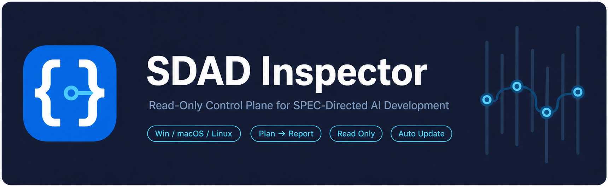
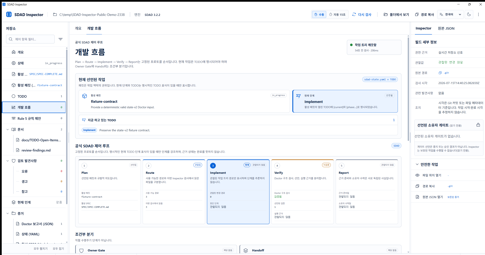
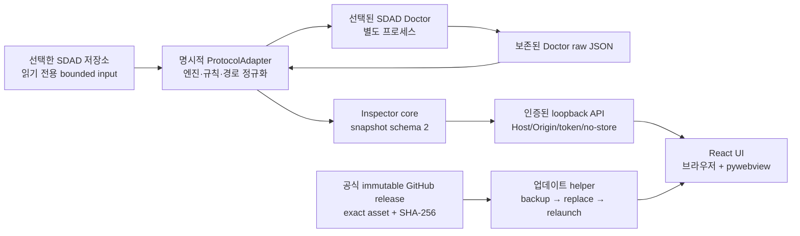

# SDAD Inspector

[](https://github.com/LiveTrack-X/sdad-inspector/actions/workflows/cross-platform.yml)
[](https://github.com/LiveTrack-X/sdad-inspector/releases/latest)

SDAD 프로젝트의 현재 상태를 한 화면에서 읽어 주는 로컬 뷰어입니다.
어떤 SPEC이 기준인지, 지금 활성 패킷은 무엇인지, 남은 TODO와 발견사항은
무엇인지 찾아다니지 않아도 됩니다. 저장소를 고르면 왼쪽에는 문서와 상태,
가운데에는 현재 작업, 오른쪽에는 선택한 값의 출처가 표시됩니다.

검사 대상 저장소는 **읽기 전용**입니다. Inspector는 프로젝트에 선언된 검증
명령을 실행하거나 소스·SDAD 파일을 수정하지 않습니다. 제품 자체의 업데이트만
Inspector 전용 앱 데이터와 현재 포터블 실행 파일에 씁니다.

> **0.0.1 is a regular GitHub Release, but remains unsigned.** 설치 프로그램이
> 아니며 코드 서명·공증이 없습니다. 운영체제가
> 경고하거나 실행을 막을 수 있습니다. 실행 전 `SHA256SUMS`를 확인하고, 조직의
> 보안 정책이 허용하지 않으면 보호 기능을 우회하지 말고 소스 실행 방식을 이용하세요.

## 3분 만에 시작하기

Python이나 Node.js를 설치할 필요가 없습니다. 각 압축 파일 안에는 런타임, UI,
SDAD 3.2.2 엔진이 포함된 **single portable executable** 하나만 들어 있습니다.

1. [`v0.0.1` 릴리스](https://github.com/LiveTrack-X/sdad-inspector/releases/tag/v0.0.1)를 엽니다.
2. 내 컴퓨터에 맞는 압축 파일과 `SHA256SUMS`를 받습니다.
3. 아래 방법으로 해시를 확인합니다.
4. 압축을 풀고 실행 파일을 엽니다.
5. 폴더 선택 창에서 `sdad-state.yaml`이 있는 프로젝트 루트를 고릅니다.

| 컴퓨터 | 받을 파일 | 압축 안의 실행 파일 |
| --- | --- | --- |
| Windows x64 | `SDAD-Inspector-0.0.1-windows-x64.zip` | `SDAD-Inspector.exe` |
| macOS Apple Silicon | `SDAD-Inspector-0.0.1-macos-arm64.tar.gz` | `SDAD-Inspector` |
| Linux x64 | `SDAD-Inspector-0.0.1-linux-x64.tar.gz` | `SDAD-Inspector` |

현재 릴리스에 없는 아키텍처(예: Intel Mac)는 지원된다고 가정하지 마세요. 소스
실행은 가능할 수 있지만, 공개 릴리스의 빌드·스모크 근거에는 포함되지 않습니다.

### Windows에서 해시 확인

압축 파일과 `SHA256SUMS`가 같은 폴더에 있을 때 PowerShell에서 실행합니다.
마지막 결과가 `True`여야 합니다.

```powershell
$archive = Get-Item .\SDAD-Inspector-0.0.1-windows-x64.zip
$expected = (Select-String .\SHA256SUMS -Pattern $archive.Name).Line.Split()[0]
$actual = (Get-FileHash $archive -Algorithm SHA256).Hash.ToLower()
$actual -eq $expected
```

### macOS에서 해시 확인

```bash
grep 'macos-arm64' SHA256SUMS | shasum -a 256 -c -
```

### Linux에서 해시 확인

```bash
grep 'linux-x64' SHA256SUMS | sha256sum -c -
```

macOS/Linux에서 실행 권한이 없다는 메시지가 나오면 압축을 푼 실행 파일에만
권한을 줍니다.

```bash
chmod +x ./SDAD-Inspector
./SDAD-Inspector /path/to/your-project
```

Windows에서는 더블클릭하거나 프로젝트 경로를 인수로 줄 수 있습니다.

```powershell
.\SDAD-Inspector.exe "C:\path\to\your-project"
```

## 화면은 이렇게 읽으면 됩니다



*개인 경로나 내부 운영 문서가 없는 공개용 합성 SDAD 3.2.2 fixture를 검사한 한국어
화면입니다. 우측 상단 언어 메뉴에서 English로 바꿀 수 있고, 달 아이콘으로 다크
모드를 켤 수 있습니다.*

- **상단 바** — 현재 프로젝트와 번들 SDAD 엔진을 확인하고, 수동/AUTO 15초
  재검사, 폴더 열기, 경로 복사, 언어, 테마를 조작합니다.
- **왼쪽 저장소 패널** — 상태, 활성 SPEC, 활성 패킷, TODO, 개발 흐름, Rule 5
  제안, 연결된 문서, 발견사항으로 바로 이동합니다.
- **가운데 작업 공간** — 패킷 목표와 상태, 남은 일/완료된 일, 관찰된 변경 파일,
  최근 커밋, 핸드오프를 함께 봅니다.
- **개발 흐름** — 공식 `Plan → Route → Implement → Verify → Report` 순서와 조건부
  Owner Gate/Handoff를 구분합니다. 명시된 현재 TODO가 있으면 해당 공식 단계만
  강조하고, 실제로 읽은 근거 문서를 클릭해 읽기 전용 뷰어에서 열 수 있습니다.
- **오른쪽 Inspector** — 선택한 값의 권한 근거, 관찰값, 원본 경로, 검사 시각,
  관련 발견사항과 안전한 읽기 전용 동작을 보여 줍니다.

표시된 Git 변경이나 커밋은 관찰 근거일 뿐입니다. Inspector는 “이 파일은 어느
단계 때문에 바뀌었다”거나 “작업이 몇 퍼센트 끝났다”고 추측하지 않습니다.

## 어떤 SDAD에 붙여 쓸 수 있나요?

### Which SDAD projects can it inspect?

[SDAD Protocol](https://github.com/LiveTrack-X/spec-driven-ai-development)을
도입했고 저장소 루트에 `sdad-state.yaml`이 있는 프로젝트라면 연결할 수 있습니다.
SDAD 프레임워크 저장소만 보는 도구가 아니라, SDAD 방식으로 운영하는 실제 제품
저장소를 읽는 도구입니다.

| 계약 | 0.0.1 범위 |
| --- | --- |
| 번들 실행 기준 | Official SDAD Protocol `v3.2.2` |
| 기본 프로토콜 어댑터 | `official-sdad-3` |
| Doctor 호환성 fixture | 릴리스된 `v3.2.1`, `v3.2.2` |
| SDAD state schema | 1, 2 |
| Doctor report schema | 1, 2 |
| Inspector snapshot schema | 2 |
| 프로젝트 시작점 | 루트 `sdad-state.yaml` |
| 의도/권한 기준 | state가 선언한 단일 `active_spec` |

### Inspector와 SDAD 엔진은 분리되어 있습니다

Inspector UI와 loopback 서버는 특정 SDAD 버전의 파일 규칙을 직접 해석하지
않습니다. 명시적으로 선택된 **프로토콜 어댑터**가 엔진 인증, Doctor 실행 인수,
report/state 스키마 정규화, 제어 파일 경로, 근거 문서와 선택적 Rule 5 기능을
Inspector snapshot schema 2로 변환합니다. UI는 이 정규화된 snapshot만 읽습니다.

`0.0.1` 포터블 앱에는 검증된 `official-sdad-3` 어댑터와 SDAD 3.2.2 엔진만
포함됩니다. 따라서 구조가 확장 가능하다는 사실을 “모든 SDAD 변형 지원”으로
해석하면 안 됩니다. 다른 SDAD 계열은 다음 조건을 갖춘 별도 어댑터와 호환성
fixture가 필요합니다.

- `ProtocolAdapter` 계약을 구현한, 운영자가 설치한 Python 코드
- 지원 엔진·report/state 스키마와 제어 경로의 명시적 선언
- `register_protocol_adapter(...)`를 통한 프로세스 로컬 등록
- 실행 시 `--protocol-adapter <adapter-id>` 또는 Python API의 명시적 선택

검사 대상 저장소가 어댑터 이름이나 Python 경로를 써서 코드를 자동 로드하게 만들
수는 없습니다. 이 제한은 문서를 여는 행위가 코드 실행 권한으로 바뀌지 않게 하는
보안 경계입니다. 공개 확장 계약과 최소 구현 예시는
[`docs/SDAD_INTEGRATION_CONTRACT.md`](docs/SDAD_INTEGRATION_CONTRACT.md)에 있습니다.

가장 알아보기 쉬운 프로젝트 구조는 다음과 같습니다.

```text
your-project/
├─ sdad-state.yaml              # Inspector가 가장 먼저 읽는 실행 상태
├─ SPEC/
│  └─ SPEC-COMPLETE.md          # state가 지정한 현재 의도
├─ docs/
│  ├─ INDEX.md                  # 문서 라우터(선택 사항)
│  └─ TODO-Open-Items.md        # 현재 패킷 TODO
├─ review-findings.md           # 열려 있는 발견사항
└─ ...your product source and tests
```

state v2의 작은 예시는 다음과 같습니다.

```yaml
version: 2
scale: standard
execution_scope: packet
active_spec: SPEC/SPEC-COMPLETE.md
active_packet:
  id: APP-001
  objective: 현재 범위의 변경을 완료한다.
  status: in_progress
validation_for: APP-001
owner_gates: []
routed_docs:
  - docs/TODO-Open-Items.md
  - review-findings.md
```

`routed_docs`는 “UI에서 읽을 수 있는 후보”이지 자동 권한 부여가 아닙니다.
Inspector는 파일 이름만 보고 SPEC이나 결정권을 만들어 내지 않습니다. 정확한
연동 계약은 [`docs/SDAD_INTEGRATION_CONTRACT.md`](docs/SDAD_INTEGRATION_CONTRACT.md)를
참고하세요.

### 지금 하는 작업과 단계를 정확히 표시하려면

현재 패킷 TODO 한 항목에 다음처럼 명시적인 표시를 붙일 수 있습니다.

```markdown
- [ ] [packet:APP-001] [phase:Implement] [current] 로그인 오류 처리를 수정한다.
```

`phase`에는 공식 단계인 `Plan`, `Route`, `Implement`, `Verify`, `Report`만 씁니다.
Inspector는 같은 활성 패킷의 **열린 TODO**에 `[current]`와 유효한 `[phase:…]`가
함께 있을 때만 현재 단계를 강조합니다. 표시가 없거나 서로 충돌하면 “현재 단계
미선언” 또는 “현재 단계가 모호함”이라고 보여 줍니다. 패킷의 일반 상태,
TODO 순서·개수, Git 커밋·시간으로 현재 단계를 추측하지 않습니다.

이 표시는 Inspector의 읽기 쉬운 화면을 위한 선택적 TODO 메타데이터입니다. SDAD의
권한, 완료, 검증, 소유자 수락 의미를 바꾸지 않습니다. 활성 SPEC, TODO 원장,
발견사항, 현재 핸드오프, state에 라우팅된 Markdown은 “근거 문서” 목록에서 바로
열 수 있습니다. 문서를 열 수 있다는 사실도 검증이나 수락을 뜻하지 않습니다.

## 자동 제품 업데이트

포터블 릴리스 앱은 시작할 때와 실행 중 6시간마다 제품 업데이트를 확인합니다.
업데이트가 있으면 다음 순서가 자동으로 진행됩니다.

1. `LiveTrack-X/sdad-inspector`의 공식 GitHub Releases API만 확인합니다.
2. 현재보다 새롭고 게시가 끝난 **immutable release**만 선택합니다.
3. 현재 OS/아키텍처와 정확히 일치하는 자산 하나를 백그라운드에서 받습니다.
4. GitHub가 제공한 SHA-256 digest, 크기, 다운로드 호스트, 압축 형식, 내부 파일
   이름과 개수를 검증합니다.
5. 검사가 진행 중이 아니면 10초 카운트다운 뒤 검증된 새 실행 파일의 복사본을
   업데이트 헬퍼로 실행합니다.
6. 헬퍼가 현재 앱 종료를 기다리고 이전 실행 파일 하나를 `.previous`로 보관한 뒤,
   현재 포터블 실행 파일을 원자적으로 교체하고 같은 프로젝트를 다시 엽니다.

상단 알림에서 **나중에**를 누르면 이번 실행의 자동 재시작을 미룰 수 있습니다.
교체가 실패하면 가능한 경우 이전 파일을 복원하고 이전 앱을 다시 엽니다. 실패한
교체 뒤에는 재시작 루프를 막기 위해 자동 재시도를 중지하며, 사용자가 **다시
시도**를 눌러야 합니다.

이 기능은 **Inspector 제품 실행 파일만** 업데이트합니다. SDAD 엔진을 몰래 받거나
검사 대상 프로젝트를 마이그레이션·수정하지 않습니다. 소스 실행과 브라우저 모드는
자기 파일을 교체하지 않습니다.

unsigned 포터블 앱의 자동 업데이트는 서명된 설치 프로그램과 같은 보증이 아닙니다. 릴리스
불변성, GitHub digest, 정확한 자산 계약과 백업으로 범위를 줄였지만, 조직 정책상
unsigned 코드를 자동 실행할 수 없다면 소스 모드를 사용하세요.

## Inspector가 하는 일 / 하지 않는 일

### 하는 일

- 인증된 번들 SDAD Doctor를 별도 프로세스로 실행하고 실제 exit code와 JSON 근거를
  보존합니다.
- 현재 SPEC·패킷·TODO·발견사항·owner gate·선언된 검증·Git 관찰값을 한 화면에
  정규화합니다.
- 한국어/English, 라이트/다크, 넓은 화면/좁은 화면에서 같은 React UI를 사용합니다.
- 검사 대상 밖의 사용자가 고른 위치에 redacted HTML 보고서를 만들 수 있습니다.
- 완전한 발견사항을 미리 본 뒤 확인했을 때만 비활성 Rule 5 Markdown 제안을 외부
  경로에 저장합니다.

### 하지 않는 일

- 프로젝트가 선언한 검증 명령 실행
- 프로젝트 소스, SPEC, state, TODO 자동 수정
- 자동 SDAD 엔진 다운로드 또는 프로젝트 마이그레이션
- 저장소 Markdown 안의 HTML/스크립트 실행
- 일반 JavaScript→Python 또는 임의 파일시스템 브리지 제공
- 텔레메트리 전송

최근 프로젝트 목록, 언어/테마/패널 폭, 제품 업데이트 staging은 OS별 사용자 앱
데이터 위치에 저장되며 검사 대상 저장소에는 기록되지 않습니다.

## 다른 컴퓨터에서 실행되지 않을 때

### `Failed to load Python DLL ... _internal\python313.dll`

이 메시지는 현재 single-file 릴리스가 아니라 예전 one-folder 빌드의 실행 파일만
복사했거나 압축을 일부만 푼 경우에 발생합니다. 현재 릴리스는 CPython 3.12 기반의
단일 실행 파일이며 옆에 `_internal` 폴더가 필요하지 않습니다.

1. 기존 복사본과 `_internal` 폴더를 섞어 쓰지 않습니다.
2. 공식 `v0.0.1` 자산을 새 폴더에 다시 받습니다.
3. `SHA256SUMS`를 확인합니다.
4. 압축 속 실행 파일 하나를 꺼내 그 파일을 실행합니다.

그래도 같은 경로가 보인다면 바탕 화면/작업 표시줄 바로가기가 이전 실행 파일을
가리키는지 확인하세요.

### Windows 탐색기에 예전 파이썬 아이콘이 보임

`v0.0.1`의 EXE에는 SDAD Inspector 로고와 제품 버전 정보가 들어 있습니다. 다만
Windows 탐색기는 실행 파일의 전체 경로를 기준으로 아이콘을 캐시하기 때문에, 같은
폴더의 같은 `SDAD-Inspector.exe`를 교체하면 예전 PyInstaller 아이콘이 잠시 남을 수
있습니다.

1. 파일을 다른 폴더로 복사하거나 이름을 잠시 바꿔 아이콘을 확인합니다.
2. 파일 **속성 → 자세히**에서 제품 이름 `SDAD Inspector`, 제품 버전 `0.0.1`을
   확인합니다.
3. 그래도 이전 아이콘이면 Windows를 다시 시작한 뒤 확인합니다.

앱의 자동 업데이트 경로는 교체 완료 후 Windows 셸에 아이콘 새로 고침을 요청합니다.
아이콘 표시는 실행 파일의 동작이나 SHA-256 검증 결과와 별개입니다.

### 창이 열리지 않음

- **Windows:** OS WebView2 런타임이 필요합니다. 최신 Windows에는 대개 포함되어
  있지만 제거된 환경이라면 조직 정책에 따라 설치해야 합니다.
- **macOS:** 현재 공개 자산은 Apple Silicon arm64이며 unsigned입니다. Gatekeeper
  정책이 허용하지 않으면 보호를 우회하지 말고 소스 모드를 사용하세요.
- **Linux:** 그래픽 데스크톱, EGL/GL/XCB 계열 런타임, 실행 가능한 임시 파일시스템이
  필요합니다. 자세한 CI 기준은 [`docs/CROSS_PLATFORM.md`](docs/CROSS_PLATFORM.md)에
  있습니다.

## 소스에서 실행하기

필요한 도구는 Python 3.10+, Node.js 22+, Git입니다. 네이티브 릴리스 빌드는
CPython 3.12를 정확히 사용합니다.

```bash
git clone https://github.com/LiveTrack-X/sdad-inspector.git
cd sdad-inspector
git clone --branch v3.2.2 --depth 1 \
  https://github.com/LiveTrack-X/spec-driven-ai-development.git \
  .runtime/sdad-v3.2.2
```

### Windows PowerShell

```powershell
python -m venv .venv
.\.venv\Scripts\Activate.ps1
python -m pip install -e ".[desktop,build]"
npm --prefix web ci
npm --prefix web run build
sdad-inspector desktop "C:\path\to\your-project" --sdad-checkout .runtime\sdad-v3.2.2
```

### macOS / Linux

```bash
python -m venv .venv
source .venv/bin/activate
python -m pip install -e ".[desktop,build]"
npm --prefix web ci
npm --prefix web run build
sdad-inspector desktop /path/to/your-project --sdad-checkout .runtime/sdad-v3.2.2
```

폴더 선택 창을 쓰려면 프로젝트 경로를 생략해도 됩니다.

### 브라우저 UI

```bash
sdad-inspector serve /path/to/your-project \
  --sdad-checkout .runtime/sdad-v3.2.2
```

서버는 `127.0.0.1`에만 바인딩되고 매 실행마다 새 세션 토큰을 사용합니다. Host와
Origin을 확인하고 API 응답에 `no-store`를 적용합니다.

### Snapshot JSON

```bash
sdad-inspector inspect /path/to/your-project \
  --sdad-checkout .runtime/sdad-v3.2.2 --pretty
```

### Redacted HTML 보고서

출력 경로는 검사 대상 프로젝트 밖이어야 합니다.

```bash
sdad-inspector report /path/to/your-project \
  --sdad-checkout .runtime/sdad-v3.2.2 \
  --output /path/outside-project/sdad-report.html \
  --redact-paths --redact-evidence
```

소스/브라우저 실행에서는 자동 제품 업데이트가 비활성화됩니다. 새 버전을 쓰려면
Git checkout과 의존성을 직접 갱신하세요.

## 구조와 보안 경계



프로젝트 정보는 선택된 어댑터를 지나 한 방향으로 snapshot에 들어옵니다. UI는
엔진 구현, 일반 파일시스템이나 Python 브리지를 받지 않습니다. 저장소는 어댑터
코드를 선택하거나 로드할 수 없습니다. 제품 업데이트 경로는 프로젝트 읽기·SDAD
엔진 경로와 분리되어 있고, 정해진 GitHub 저장소·자산·staging·실행 파일만
다룹니다.

```text
sdad_inspector/       Python core, protocol registry/adapters, loopback server, desktop, updater
web/                  React/Vite 공용 UI와 실제 로고 자산
scripts/              공개 경계, 브라우저, 네이티브, 릴리스 검증
packaging/            PyInstaller one-file 및 OS 아이콘
tests/                Python/프런트엔드 회귀와 SDAD 호환 fixture
docs/                 공개 연동·플랫폼·디자인·현지화·릴리스 문서
.github/workflows/    3개 OS 지속 검증과 tagged 정식 릴리스
```

더 자세한 공개 문서:

- [`docs/SDAD_INTEGRATION_CONTRACT.md`](docs/SDAD_INTEGRATION_CONTRACT.md) — 엔진,
  report/state schema 호환성
- [`docs/CROSS_PLATFORM.md`](docs/CROSS_PLATFORM.md) — OS별 어댑터와 근거 한계
- [`docs/DESIGN_SYSTEM.md`](docs/DESIGN_SYSTEM.md) — 화면 구조, 토큰, 컴포넌트,
  반응형 동작
- [`docs/LOCALIZATION.md`](docs/LOCALIZATION.md) — 한국어/English UI와 원문 근거 경계
- [`docs/releases/v0.0.1.md`](docs/releases/v0.0.1.md) — 현재 릴리스
  자산, 자동 제품 업데이트, 알려진 한계

## 빌드와 검증

로컬 unsigned one-file 빌드는 공식 CPython 3.12로 실행합니다.

```bash
npm --prefix web run build
python3.12 scripts/build_native.py --sdad-checkout .runtime/sdad-v3.2.2
python3.12 scripts/smoke_native.py .
```

저장소 루트의 전체 공개 릴리스 게이트:

```bash
python scripts/validate_public_repository.py
python scripts/validate_release.py
python -m unittest discover -s tests -v
npm --prefix web run typecheck
npm --prefix web test -- --run
npm --prefix web run build
python scripts/validate_browser_contract.py --sdad-checkout .runtime/sdad-v3.2.2
python scripts/validate_static_report.py --sdad-checkout .runtime/sdad-v3.2.2
python scripts/validate_native_contract.py --sdad-checkout .runtime/sdad-v3.2.2
python scripts/build_native.py --check --sdad-checkout .runtime/sdad-v3.2.2
```

일반 `cross-platform.yml`은 Windows, macOS, Linux에서 소스·UI·네이티브 빌드와
직접 실행 스모크를 수행하고, 별도 깨끗한 runner가 내려받은 압축을 다시 검사하고
실행합니다. 이 단기 CI 자산은 릴리스가 아닙니다.

정확한 `v0.0.1` 태그는 같은 검증을 다시 수행한 뒤 세 플랫폼 압축과
`SHA256SUMS`를 draft release에 올립니다. 각 자산의 GitHub artifact attestation을
만들고, 모든 단계가 성공한 뒤에만 regular release를 게시합니다. 저장소의 immutable
release 설정이 게시 후 태그와 자산 변경을 막습니다.

## 현재 릴리스의 한계

- installer, code signing, notarization, package registry, 안정 버전 지원 보증이 없습니다.
- automatic product update가 포함되어 있지만 unsigned 포터블 범위입니다. 공식
  immutable release와 digest를 검증하고 이전 실행 파일 하나를 보관해도, 서명된
  installer의 upgrade/uninstall/복구 보증을 대신하지 않습니다.
- GitHub-hosted runner의 정확한 빌드·스모크 결과는 모든 OS 버전, 보안 정책, GPU,
  디스플레이 서버와 데스크톱 환경을 일반적으로 보증하지 않습니다.
- PyInstaller one-file 앱은 시작할 때 임베디드 런타임을 OS 임시 디렉터리에 풉니다.
  Linux 임시 파일시스템이 `noexec`이면 현재 검증 범위 밖입니다.
- 실행 파일은 Python과 앱 의존성을 포함하지만 OS 웹뷰/디스플레이 구성요소까지
  내장하지 않습니다.
- Inspector는 SDAD 편집기나 자율 수리 도구가 아닙니다.
- 공개 저장소라는 사실만으로 별도 라이선스 권리가 생기지는 않습니다. 재배포나
  파생 사용 전 저장소 조건을 확인하세요.

문제를 제보할 때는 Inspector 버전, OS/아키텍처, SDAD 버전, Doctor exit code,
재현 순서를 적어 주세요. 비밀값, `.env`, 고객 원본 데이터, 비공개 저장소 내용은
첨부하지 마세요.
