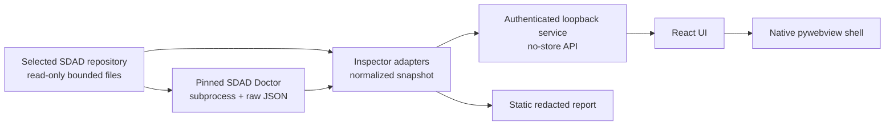

# SDAD Inspector

[](https://github.com/LiveTrack-X/sdad-inspector/actions/workflows/cross-platform.yml)
[](https://github.com/LiveTrack-X/sdad-inspector/releases)

SDAD Inspector is a local, read-only desktop and browser viewer for repositories
that use the
[SDAD Protocol](https://github.com/LiveTrack-X/spec-driven-ai-development).
It brings the active packet, SPEC authority, TODO work, findings, owner gates,
validation declarations, live Git observations, and evidence provenance into a
single Korean/English interface.

> **0.0.1 alpha is experimental and unsigned.** The release archives are not
> installers, are not code-signed or notarized, and may be warned about or
> blocked by the operating system. Verify `SHA256SUMS` and inspect the public
> source before running them. The hosted-runner build and smoke checks apply to
> the exact tagged archives; they are not a broad stable-support claim.

Each OS archive contains one **single portable executable** with the Python
3.12 runtime, UI, and pinned SDAD engine embedded. The destination computer does
not need Python installed and there is no `_internal` folder to copy alongside
the executable.

## What it does

- Opens an SDAD repository without modifying it.
- Runs a pinned, authenticated SDAD Doctor in a subprocess and preserves its
  real exit code and raw JSON evidence.
- Shows the active SPEC, current packet, packet TODO, findings, routed Markdown,
  observed Git status/commits, handoff history, and owner gates.
- Provides one shared responsive UI through the native shell or loopback
  browser, with Korean/English and light/dark preferences.
- Exports a redacted standalone HTML report outside the inspected repository.
- Can prepare a Rule 5 proposal only after preview and confirmation; the result
  is an inactive Markdown file at a separate owner-selected path.

It does **not** execute validation commands declared by the project, edit the
project, silently migrate SDAD state, download engines at runtime, or expose a
JavaScript-to-Python bridge.

## Which SDAD projects can it inspect?

Attach Inspector to a repository that follows the SDAD Protocol and keeps
`sdad-state.yaml` at its repository root. It is not limited to the upstream SDAD
framework repository: it is intended for any product repository that has
adopted that repository-local protocol.

| Contract | 0.0.1 alpha boundary |
| --- | --- |
| Bundled/runtime baseline | Official SDAD Protocol `v3.2.2` |
| Doctor compatibility corpus | Released `v3.2.1` and `v3.2.2` fixtures |
| SDAD state schemas | 1 and 2 |
| Doctor report schemas | 1 and 2 |
| Primary project entry | Root `sdad-state.yaml` |
| Normative intent | The single `active_spec` declared by state |

The compatibility corpus proves bounded parsing of those released contracts;
it does not promise compatibility with future SDAD versions. The packaged alpha
always uses its bundled `v3.2.2` runtime.

A typical inspected repository looks like this:

```text
your-project/
├─ sdad-state.yaml
├─ SPEC/
│  └─ SPEC-COMPLETE.md
├─ docs/
│  ├─ INDEX.md
│  └─ TODO-Open-Items.md
├─ review-findings.md
└─ ...your product source and tests
```

At minimum, state must select the active SPEC and packet. A state-v2 project can
also declare its execution boundary, validation owner, gates, and eligible
documents:

```yaml
version: 2
scale: standard
execution_scope: packet
active_spec: SPEC/SPEC-COMPLETE.md
active_packet:
  id: APP-001
  objective: Deliver the current bounded change.
  status: in_progress
validation_for: APP-001
owner_gates: []
routed_docs:
  - docs/TODO-Open-Items.md
  - review-findings.md
```

Inspector treats those fields as declared project evidence. It does not infer
authority from filenames or turn a routed document into authority.

## Use the 0.0.1 alpha release

1. Open the
   [`v0.0.1-alpha.2` release](https://github.com/LiveTrack-X/sdad-inspector/releases/tag/v0.0.1-alpha.2).
2. Download `SHA256SUMS` and exactly one archive for your operating system.
   The filename records the OS and the architecture of the GitHub-hosted runner.
3. Verify the archive before extracting it.
4. Extract the archive. It contains exactly one portable executable.
5. Start Inspector with an SDAD project path, or start it without a path and use
   the native folder picker.

Verify on Linux or macOS from the directory containing all downloaded assets:

```bash
sha256sum -c SHA256SUMS
```

On Windows PowerShell, compute the archive hash and compare it with the matching
line in `SHA256SUMS`:

```powershell
Get-FileHash .\SDAD-Inspector-0.0.1-alpha.2-windows-*.zip -Algorithm SHA256
Get-Content .\SHA256SUMS
```

Run the extracted build:

| OS | Launch path |
| --- | --- |
| Windows | `.\SDAD-Inspector.exe C:\path\to\your-project` |
| macOS | `./SDAD-Inspector /path/to/your-project` |
| Linux | `./SDAD-Inspector /path/to/your-project` |

Because the alpha is unsigned, Windows SmartScreen or macOS Gatekeeper may stop
it. Keep the protection enabled; if the source and checksum are not sufficient
for your environment's policy, run from source instead of bypassing that policy.

## Run from source

Requirements:

- Python 3.10 or newer;
- Node.js 22 or newer;
- Git;
- platform prerequisites required by `pywebview` for the optional desktop mode.

Clone Inspector and the supported official SDAD runtime:

```bash
git clone https://github.com/LiveTrack-X/sdad-inspector.git
cd sdad-inspector
git clone --branch v3.2.2 --depth 1 \
  https://github.com/LiveTrack-X/spec-driven-ai-development.git \
  .runtime/sdad-v3.2.2
```

Install the Python and frontend dependencies:

```bash
python -m venv .venv
source .venv/bin/activate
python -m pip install -e ".[desktop,build]"
npm --prefix web ci
npm --prefix web run build
```

On Windows PowerShell, activate the environment with
`.\.venv\Scripts\Activate.ps1` instead of the `source` line. You can also avoid
activation by invoking the Python and `sdad-inspector` executables directly from
`.venv`. The command shapes below are otherwise the same on every OS.

### Desktop app

```bash
sdad-inspector desktop /path/to/your-project \
  --sdad-checkout .runtime/sdad-v3.2.2
```

### Loopback browser app

```bash
sdad-inspector serve /path/to/your-project \
  --sdad-checkout .runtime/sdad-v3.2.2
```

The server binds to `127.0.0.1`, chooses a free port by default, requires a
per-launch session token, rejects foreign host/origin requests, and sends
no-store/security headers.

### Snapshot JSON

```bash
sdad-inspector inspect /path/to/your-project \
  --sdad-checkout .runtime/sdad-v3.2.2 \
  --pretty
```

### Redacted static report

The output must be outside the inspected repository:

```bash
sdad-inspector report /path/to/your-project \
  --sdad-checkout .runtime/sdad-v3.2.2 \
  --output /path/outside-project/sdad-report.html \
  --redact-paths --redact-evidence
```

## Architecture



The important boundary is one-way: project files and Doctor output flow into an
Inspector-owned snapshot. The UI never receives a general filesystem or Python
bridge, and displayed repository Markdown is safely rendered without executing
repository HTML.

### Repository structure

```text
sdad_inspector/       Python core, adapters, server, desktop shell, reports
web/                  Shared React/Vite browser and native frontend
scripts/              Contract checks, native build/smoke, release packaging
packaging/            PyInstaller one-file specification
tests/                Python regressions and frozen SDAD contract fixtures
SPEC/                  Normative product intent
docs/                  Integration, platform, evidence, and operating docs
.github/workflows/    Continuous checks and tagged alpha release automation
design/reference/     Owner-selected visual reference retained as design input
```

Start documentation routing at [`docs/INDEX.md`](docs/INDEX.md). The most useful
deeper documents are:

- [`docs/SDAD_INTEGRATION_CONTRACT.md`](docs/SDAD_INTEGRATION_CONTRACT.md) —
  exact engine/report/state compatibility;
- [`docs/CROSS_PLATFORM.md`](docs/CROSS_PLATFORM.md) — platform adapters and
  evidence limits;
- [`docs/LOCALIZATION.md`](docs/LOCALIZATION.md) — Korean/English behavior and
  verbatim repository-evidence boundary;
- [`docs/UPDATE_AND_MIGRATION.md`](docs/UPDATE_AND_MIGRATION.md) — future design,
  not a current auto-update or migration feature.

## Read-only and security boundary

- Project reads are repository-relative, size/line bounded, canonicalized, and
  checked against traversal, symbolic-link, hard-link, and sensitive-file paths.
- Doctor is accepted only from the pinned clean release contract bundled with
  the app or explicitly supplied in source mode.
- Declared validation commands are shown as metadata and never executed.
- Project selection, refresh, recent-project preferences, and history clearing
  do not write to the inspected repository.
- Static reports require a destination outside the project and default to no
  overwrite.
- Rule 5 export requires a complete finding, exact preview digest, confirmation,
  and a separate Save As destination. It never activates the proposal.

## Build and validate

Native packaging specifically requires official CPython 3.12. Build an unsigned
local one-file preview with that interpreter:

```bash
npm --prefix web run build
python3.12 scripts/build_native.py \
  --sdad-checkout .runtime/sdad-v3.2.2
python3.12 scripts/smoke_native.py .
```

Run the release-relevant local gates from the repository root:

```bash
python scripts/validate_public_repository.py
python scripts/validate_release.py
python -m unittest discover -s tests -v
npm --prefix web run typecheck
npm --prefix web test -- --run
npm --prefix web run build
python scripts/validate_browser_contract.py
python scripts/validate_static_report.py
python scripts/validate_native_contract.py --sdad-checkout .runtime/sdad-v3.2.2
python scripts/build_native.py --check --sdad-checkout .runtime/sdad-v3.2.2
```

The normal `cross-platform.yml` workflow runs source, frontend, one-file native
build, direct smoke, and separate downloaded-archive smoke checks on Windows,
macOS, and Ubuntu. Its archives are short-lived CI evidence, not releases.
Pushing the exact
tag `v0.0.1-alpha.2` invokes `release.yml`, repeats those gates on the tagged
commit with CPython 3.12, packages one executable per OS, and then downloads and
smoke-launches each archive in a separate clean hosted-runner job. It writes
`SHA256SUMS` and publishes a GitHub prerelease only after all build and portable
smoke jobs pass.

## Alpha limitations

- No installer, signing, notarization, updater, package-registry publication,
  deployment, upgrade/uninstall/rollback guarantee, or production-readiness
  claim.
- Hosted GitHub runners cannot establish compatibility with every OS release,
  desktop environment, security policy, GPU, or display-server configuration.
- The macOS and Windows executables may be blocked because they are
  unsigned.
- A one-file executable expands its embedded runtime into an OS temporary
  directory at startup. Linux systems whose temporary filesystem is mounted
  `noexec` are outside this alpha's verified environments.
- The executable embeds Python and application dependencies, not the operating
  system's browser/display stack. Windows needs WebView2; Linux needs a working
  desktop plus EGL/GL/XCB libraries (the CI baseline installs `libegl1`,
  `libgl1`, and the listed XCB runtime packages).
- The product is intentionally an Inspector, not an SDAD editor or autonomous
  repair tool.
- Public visibility does not itself add a license grant; check repository terms
  before redistribution or derivative use.

Issues should include the Inspector version, OS/architecture, SDAD version,
Doctor exit code, and a redacted reproduction. Never attach secrets, `.env`
files, raw customer data, or private repositories.
