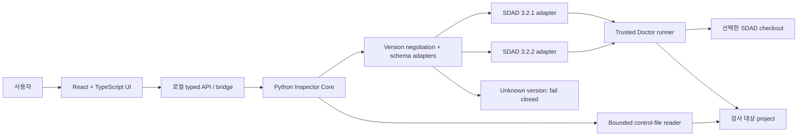

# SDAD Inspector 제품·기술 기획서

- 문서 상태: 기획 전용 — 구현 시작 전
- 작성 기준일: 2026-07-15 (KST)
- 제품명: **SDAD Inspector**
- 대상 폴더: repository root (`.`)
- 기준 SDAD 저장소: `https://github.com/LiveTrack-X/spec-driven-ai-development`

## 1. 결론

첫 버전은 **로컬 Python 코어 + React/TypeScript 웹 UI**로 만든다.

사용자는 프로젝트 폴더를 고르고, Inspector는 로컬에서만 SDAD Doctor와
제한된 메타데이터 검사를 실행한다. UI는 기본 브라우저에서 열리므로 Windows,
macOS, Linux가 같은 코드 경로를 쓴다. 네이티브 설치 파일은 코어와 UI가 검증된
뒤 `pywebview + PyInstaller`로 감싸고, 앱 스토어·자동 업데이트·더 강한 데스크톱
통합이 필요해질 때만 Tauri 2 셸을 검토한다.

이 순서가 적합한 이유는 다음과 같다.

- 현재 SDAD Doctor와 validator가 Python 표준 라이브러리 기반이라 기존 로직을
  재구현하지 않아도 된다.
- 순수 PWA는 임의의 로컬 저장소를 안정적으로 읽거나 Doctor를 실행할 수 없다.
- Electron은 가능하지만 Chromium과 Node 런타임을 함께 배포하면서도 Python
  연동 문제는 그대로 남는다.
- Tauri는 최종 배포 셸로 좋지만, 처음부터 Rust와 OS별 WebView/빌드 체인을
  추가하면 아직 확정되지 않은 제품 계약보다 패키징 작업이 앞서게 된다.
- Python 브라우저 모드는 패키징 전에도 세 OS에서 동일한 기능을 검증할 수 있다.

## 2. 조사 스냅샷

### 공개 안정판

- 공개 안정판은 `v3.2.1`, commit `1ec1014`이다.
- 공개 Doctor는 checkout-only, read-only 진단 도구다.
- Doctor는 validation 명령을 실행하지 않고, 네트워크를 사용하지 않으며,
  구조적 일관성만 보고한다.
- JSON report schema 1과 2가 존재하고, state schema와 Doctor version은 별도
  계약이다.

### 작업 중인 3.2.2

조사 중 관찰한 로컬 작업 스냅샷은 다음과 같다.

- worktree: `.worktrees/sdad-3.2.0`
- branch: `codex/handoff-sequence`
- committed HEAD: `adfd40afd4e1d3fcaba64cc3f5be936c5feb51fd`
- `origin/main`보다 3 commits 앞선 상태
- 조사 도중 release metadata가 미커밋 변경으로 추가되었고
  `scripts/sdad.py --version`은 `3.2.2`를 보고하기 시작했다.
- 새 릴리즈 노트는 state schema, report schema, Doctor check order, finding ID를
  바꾸지 않는다고 명시한다.
- 주요 변화는 현재 Owner 지시의 interrupt/redirect 권위, 장기 packet 수명주기,
  Rule 5 피드백 폐쇄 루프, 날짜별 `HNNNN` handoff 식별자다.

따라서 본 계획은 3.2.2를 이미 릴리즈된 것으로 간주하지 않는다. 구현 계약은
`v3.2.1` fixture와 **최종 태그가 찍힌 3.2.2 fixture**를 별도로 보존한다.

### 현재 OS 근거의 한계

SDAD 본체 CI는 현재 Ubuntu와 Windows, Python 3.10/3.12를 검사한다. macOS는
문서상 Python 코드가 동작할 가능성이 높아도 아직 같은 수준의 CI 근거가 없다.
Inspector가 “Windows/macOS/Linux 지원”을 주장하려면 Inspector CI에 macOS를
추가하고 실제 패키지 smoke test까지 통과해야 한다.

## 3. 제품 정의

### 한 문장

**SDAD Inspector는 로컬 SDAD 프로젝트의 현재 실행 경계, 권위, 구조적 진단,
연속성을 터미널 없이 이해하게 해 주는 읽기 전용 관제 도구다.**

### 핵심 사용자

1. SDAD를 프로젝트에 도입한 repository Owner
2. Codex, Claude Code, Gemini CLI, Cursor, Copilot을 함께 쓰는 개발자
3. 현재 packet과 검증 근거를 빠르게 검토해야 하는 reviewer
4. 다음 세션을 이어받아야 하는 작업자

### 사용자가 즉시 답을 얻어야 할 질문

1. 지금 활성화된 SPEC과 packet은 무엇인가?
2. 현재 실행 범위는 `unit`인가 `packet`인가?
3. 어떤 owner gate에서 반드시 멈춰야 하는가?
4. Doctor가 발견한 error/warning은 무엇이고 어디를 고쳐야 하는가?
5. validation은 무엇을 증명한다고 선언되어 있고, 무엇은 증명하지 못하는가?
6. 현재 handoff는 active packet과 일치하는가?
7. 어떤 정보가 권위이고 어떤 정보가 참고·과거 기록인가?
8. 이 결과를 어떤 Doctor version과 report schema가 만들었는가?

### 명시적 비목표

- AI agent 실행·스케줄링·오케스트레이션
- 선언된 validation 명령의 자동 실행
- Owner 승인·수락의 자동 생성
- SPEC 의미의 자동 판정 또는 “정답” 판정
- 기본 자동 수정, 자동 commit, 자동 push
- 전체 저장소·로그·비공개 데이터의 무제한 수집
- 근거 없는 종합 health score
- 기본 cloud sync, telemetry, 계정 시스템

## 4. 제품 원칙

1. **Read-only first**: MVP는 어떤 프로젝트 파일도 수정하지 않는다.
2. **Evidence, not confidence**: 초록색 상태도 “구조 검사 통과” 이상을 뜻하지 않는다.
3. **No fake progress**: SDAD가 현재 Plan/Route/Implement/Verify/Report 중 어느
   단계인지 근거가 없으면 추론하지 않는다.
4. **Versioned contracts**: Doctor version, state schema, report schema를 각각 표시한다.
5. **Provenance visible**: 실행한 checkout path, version, Git revision과 dirty 여부를
   가능한 범위에서 보여 준다. version string만으로 무결성을 주장하지 않는다.
6. **Local by default**: 네트워크 없이 핵심 기능이 모두 동작한다.
7. **Bounded reads**: 명시된 control file과 finding 위치만 제한적으로 읽는다.
8. **One fact, one home**: Inspector는 SDAD 권위 파일을 대체하지 않고 가리킨다.
9. **Cross-platform claims need cross-platform evidence**: 빌드 성공과 실제 실행
   smoke test를 분리해서 기록한다.

## 5. 권장 아키텍처



### 5.1 Frontend

- React + TypeScript + Vite
- 한 화면의 실제 도구 UI를 먼저 구현하고 별도 marketing shell은 만들지 않는다.
- semantic HTML, keyboard navigation, screen-reader label을 기본 계약으로 둔다.
- light/dark theme를 지원하되 상태 의미를 색에만 의존하지 않는다.
- path, ID, command에만 monospace를 사용하고 본문은 읽기 쉬운 UI 서체를 쓴다.
- 주요 UI 상태는 URL이 아니라 로컬 app state로 관리한다.

### 5.2 Python Inspector Core

책임:

- SDAD checkout과 project root 검증
- Doctor version probe
- subprocess argument-array 방식의 Doctor 실행
- exit code `0`, `1`, `2`와 JSON stdout의 독립 처리
- report schema 1/2를 내부 normalized model로 변환
- state와 control path의 제한된 요약
- path containment, symlink, size budget, Unicode path 처리
- 결과 provenance와 inspection timestamp 생성

하지 않는 일:

- shell string 실행
- validation command 실행
- repo 전체 색인
- 외부 네트워크 호출
- 파일 수정

### 5.3 SDAD 연동 경계

Inspector가 `sdad_validator` 내부 구현을 복사해 고정하면 다음 버전에서 drift가
발생한다. 초기 연동은 다음 우선순위를 따른다.

1. 선택한 신뢰 가능한 SDAD checkout의 공개 CLI를 subprocess로 호출한다.
2. 먼저 `scripts/sdad.py --version`을 호출한다.
3. 지원 버전이면 동일 버전으로 `doctor --json --strict --require-version X.Y.Z`를
   실행한다.
4. report schema 1/2를 명시적으로 adapter에서 처리한다.
5. 알 수 없는 Doctor/report schema는 추측하지 않고 unsupported 상태로 닫는다.

현재 Doctor JSON만으로는 UI에 필요한 active packet 세부 정보가 충분하지 않다.
3.2.2 릴리즈를 흔들지 않기 위해 그 릴리즈에는 새 계약을 억지로 넣지 않는다.
그 뒤 SDAD 본체에 다음 중 하나를 별도 제안한다.

- 권장: 새 read-only `snapshot --json` 명령과 독립된 snapshot schema 1
- 대안: Doctor report schema의 다음 버전에 안전한 `state_summary` 추가

snapshot에는 최소한 다음 정보만 포함한다.

- scale, execution scope, active SPEC
- active packet id/objective/status
- validation_for와 선언된 validation 목록
- current_handoff
- owner_gates
- routed_docs
- Doctor summary/checks/findings
- Doctor/state/report/snapshot schema versions

선언된 command string은 표시만 하고 실행하지 않는다.

### 5.4 로컬 통신

브라우저 모드는 `127.0.0.1`의 임의 포트에만 bind한다.

- 시작 시 일회성 session token 생성
- Origin/Host 검증
- CSP로 원격 script와 임의 연결 차단
- renderer에서 직접 filesystem 접근 금지
- backend API는 project 선택, inspect, 제한된 file reveal만 허용
- 종료 시 server와 임시 상태 정리
- 검사 snapshot은 기본적으로 메모리에만 보관

## 6. 배포 전략 비교

| 방식 | 장점 | 핵심 한계 | 결정 |
| --- | --- | --- | --- |
| 순수 웹/PWA | 배포가 가장 단순 | 로컬 Doctor 실행과 임의 repo 접근이 불충분 | 주 제품으로 사용하지 않음 |
| Electron | 세 OS와 동일 Chromium, 데스크톱 API 풍부 | Chromium+Node를 포함하고 Python 연동이 별도로 필요 | 보류 |
| Tauri 2 + Python sidecar | 작은 셸, 설치 파일·스토어 경로 우수 | Rust와 OS별 WebView/sidecar 빌드가 추가됨 | 성숙 단계 후보 |
| pywebview + PyInstaller | Python 코어 재사용, 비교적 작은 패키지 | Linux GUI backend와 시스템 WebView 편차 | 첫 네이티브 패키지 후보 |
| Python + 기본 브라우저 | 가장 빠른 세 OS 공통 검증, UI 재사용 | 초기에는 Python/checkout 준비가 필요 | **MVP 권장** |

### 배포 단계

1. **Developer/browser mode**
   - `python -m sdad_inspector <PROJECT_ROOT>`
   - 기본 브라우저를 자동으로 열고 로컬에서만 동작
2. **Static report mode**
   - 동일한 normalized snapshot으로 self-contained HTML 생성
   - 공유 시 path/evidence redaction을 명시적으로 선택
3. **Native preview**
   - pywebview로 같은 frontend와 Python API를 감쌈
4. **Signed releases**
   - Windows: signed installer/portable bundle
   - macOS: signed and notarized app/DMG, arm64와 x64 검증
   - Linux: AppImage와 `.deb`부터 시작, 배포판 범위를 명시
5. 앱 스토어, 자동 업데이트, 더 강한 native API가 필요하면 Tauri 2를 재평가

PyInstaller 결과는 OS별 산출물이므로 Windows, macOS, Linux 각각에서 빌드한다.

## 7. 정보 구조와 핵심 화면

### 7.1 Project Open

- project folder 선택
- SDAD checkout 자동 탐색 또는 직접 선택
- Doctor version, Git revision, dirty 여부 표시
- 최근 프로젝트 목록은 opt-in으로만 저장
- 지원하지 않는 version/schema는 명확한 blocker로 표시

### 7.2 Overview — hero workflow

첫 화면은 기능 목록이 아니라 현재 작업 경계를 보여 준다.

- active packet objective와 status
- active SPEC
- scale / execution scope
- owner gates
- Doctor errors/warnings
- current handoff 유무와 packet 일치 여부
- 마지막 검사 시각과 engine provenance

“Healthy 93점” 같은 합성 점수는 만들지 않는다.

### 7.3 Findings

- error 먼저, warning 다음의 안정된 정렬
- finding ID, severity, path:line, observed evidence, remediation
- keyboard로 finding 탐색
- 파일 열기는 project root 안의 검증된 path에만 허용
- raw JSON과 실제 Doctor exit code를 별도 확인 가능

### 7.4 Authority & Continuity

- active SPEC → active packet → validation_for 관계
- current_handoff → packet marker 관계
- TODO/finding → packet ID 관계
- owner gate와 conditional authorization의 존재 여부
- 3.2.2의 날짜별 `HNNNN`은 identity로만 표시하고 currentness로 추론하지 않음

### 7.5 Validation Contract

- 선언된 command와 `proves` 문장을 나란히 표시
- “선언됨”과 “실행 근거가 있음”을 분리
- MVP에서는 Run 버튼을 두지 않음
- 향후 실행 기능은 별도 owner gate, sandbox, timeout, output redaction을 갖춘
  독립 packet으로만 검토

### 7.6 Raw Evidence

- normalized snapshot
- 원본 Doctor JSON
- 실행한 명령의 안전한 재현 형태
- engine/report/state schema version
- limitation 문구

## 8. UX·시각 방향

이 제품은 marketing dashboard가 아니라 inspection tool이다.

- primary action: 프로젝트 검사 또는 다시 검사
- primary content: active packet과 actionable findings
- 보조 content: authority, handoff, raw evidence
- card grid 남용 대신 open layout, list, split pane, relationship map을 사용
- 상태색은 label·icon·텍스트와 함께 사용
- 긴 path와 한국어/영어 혼합 텍스트에서 줄바꿈·복사가 쉬워야 함
- fake metric, decorative badge, 불필요한 hero eyebrow를 만들지 않음

구현 전 시각 선택 단계에서는 실제 ImageGen 화면을 정확히 3개 만든다.

1. **Control Map** — active packet 중심의 권위·연속성 관계 화면
2. **Findings First** — triage list와 remediation을 중심으로 한 화면
3. **Split Inspector** — 좌측 control tree, 중앙 findings, 우측 evidence detail

사용자가 하나를 고른 뒤에만 그 화면을 frontend spec으로 확정한다. Creative
Production 단계는 먼저 Positioning을 잠그고, 필요할 때만 Mood boards로 넘어간다.
현재 기획 단계에서는 로고·mood board·생성 이미지를 만들지 않는다.

## 9. 보안·개인정보 경계

### 필수 위협 모델

- 악성 repo가 path traversal 또는 symlink로 root 밖 파일을 읽게 하는 경우
- finding evidence나 Markdown에 포함된 HTML/script가 UI에서 실행되는 경우
- validation command 문자열이 실수로 실행되는 경우
- loopback API를 다른 local page가 호출하는 경우
- 로그에 홈 경로·비밀 값·private corpus가 남는 경우
- 오래된 snapshot이 현재 상태처럼 보이는 경우

### 필수 통제

- canonical path와 root containment 재검증
- symlink/hard-link 정책 테스트
- 모든 repo text는 untrusted plain text로 렌더링
- raw HTML 실행 금지
- subprocess argv allowlist와 shell 비사용
- `.env`, key, token, cookie, raw customer data 자동 읽기 금지
- file size와 line count budget
- snapshot에 timestamp, project identity, engine identity 포함
- stale snapshot 표시
- network off by default
- telemetry 없음

## 10. 호환성 전략

### 독립 버전

Inspector version과 SDAD version은 분리한다.

예:

```text
SDAD Inspector 0.0.1 alpha
Supported Doctor core: 3.2.1, 3.2.2
Supported report schemas: 1, 2
Supported state schemas: 1, 2
Supported snapshot schema: 1
```

### Fixture 정책

- released `v3.2.1`의 exit 0/1/2 fixture
- 최종 released `v3.2.2`의 exit 0/1/2 fixture
- state v1 / state v2
- guarded / unguarded report
- missing state
- unsupported state version
- version mismatch
- malformed JSON과 truncated output
- Unicode, space, long path
- handoff present/absent/mismatch

dirty worktree 결과는 탐색 자료로만 쓰고 golden fixture로 고정하지 않는다.

## 11. 테스트와 릴리즈 근거

### Core

- unit tests: version negotiation, schema adapter, path safety, redaction
- contract tests: 실제 SDAD tagged checkout으로 JSON 비교
- property/fuzz tests: path와 malformed report 입력
- no-network test
- “validation command가 실행되지 않음” 회귀 test

### Frontend

- component tests: empty/loading/success/warning/error/unsupported/stale
- accessibility: keyboard, focus, labels, contrast
- responsive: 작은 laptop과 좁은 window
- copy test: 구조 통과와 제품 correctness를 혼동하지 않는 문구

### End-to-end

- browser mode: Windows, macOS, Ubuntu
- native smoke: 각 OS에서 실제 package 실행
- project path에 공백·한글·긴 경로 포함
- project switch 후 이전 snapshot 누출 없음
- packaged app에서 file reveal과 re-scan 검증

### Release claim

“세 OS 지원”은 각 OS의 동일 release candidate에서 다음이 모두 통과한 뒤에만 쓴다.

1. install/launch
2. project select
3. Doctor version probe
4. exit 0/1/2 fixture inspect
5. findings rendering
6. no-write assertion
7. clean shutdown

## 12. 단계별 실행 계획

### Packet 0 — 3.2.2 계약 동결

- 3.2.2 최종 tag/commit 확인
- release note와 Doctor/report/state schema 확인
- `v3.2.1`과 `v3.2.2` fixture 캡처
- snapshot CLI 제안 여부 결정
- Inspector의 claim boundary와 owner gates 기록

완료 조건: dirty 작업 트리가 아닌 두 release tag로 compatibility fixture가 고정됨.

### Packet 1 — Headless Inspector Core

- Python package 구조
- checkout/project discovery
- version negotiation
- Doctor runner
- schema 1/2 normalization
- JSON CLI 출력
- security/path tests

완료 조건: UI 없이도 세 OS CI에서 같은 normalized fixture 결과가 나옴.

### Packet 2 — 제품 화면 선택

- 실제 desktop 1440×1024 기준 화면 3개 생성
- Project Open과 Overview의 hero workflow 포함
- 사용자가 한 방향 선택
- 선택 화면에서 tokens, typography, component, interaction inventory 추출

완료 조건: 하나의 승인된 visual spec과 핵심 interaction path가 있음.

### Packet 3 — Browser MVP

- React/Vite UI
- loopback typed API
- Overview, Findings, Authority, Validation, Raw Evidence
- re-scan과 project switch
- accessibility와 browser E2E

완료 조건: Windows/macOS/Linux browser mode smoke가 통과하고 project write가 0건임.

### Packet 4 — Static Report

- self-contained sanitized HTML
- path/evidence redaction option
- provenance와 limitation 포함

완료 조건: network 없이 열리고 원본 project를 수정하거나 다시 읽지 않음.

### Packet 5 — Native Preview

- pywebview wrapper
- PyInstaller one-file 포터블 실행 파일 검증
- Windows/macOS/Linux build matrix
- installer/package smoke

완료 조건: 세 OS에서 같은 RC가 핵심 7-step release claim gate를 통과함.

### Packet 6 — Signed Beta

- Windows signing
- macOS signing/notarization
- Linux package 범위 확정
- upgrade/uninstall/rollback 문서
- 공개 release 전 Owner gate

완료 조건: 설치·업데이트·제거·rollback 근거와 known limitations가 공개 가능함.

### 이후 후보

- guided repair with diff preview
- validation runner with explicit owner gate
- multiple project workspace
- CI artifact import
- team-share sanitized report
- Tauri 2 shell과 updater

이 기능들은 MVP에 넣지 않는다.

## 13. SDAD 자체 적용 제안

구현을 시작할 때 이 새 프로젝트는 **Standard SDAD / execution_scope: packet**을
권장한다.

- active packet: `SI-001-contract-and-fixtures`
- owner gates: release, signing, publishing, auto-fix/write 기능
- claim boundary: “테스트한 OS와 fixture에서 read-only inspection 결과가 일치함”
- 첫 validation:
  - Python unit/contract tests
  - frontend typecheck/test/build
  - browser E2E
  - Windows/macOS/Linux smoke
  - no-write assertion
- 제품 evidence flag: yes — OS 호환성과 package claim 때문

3.2.2가 작업 중인 지금은 새 프로젝트에 unreleased adapter를 설치하지 않는다.
최종 태그가 확인된 뒤 migration preview와 함께 bootstrap한다.

## 14. 결정이 필요한 항목

구현 전 반드시 확정할 것은 하나다.

**첫 배포 목표를 `Python이 필요한 browser MVP`로 할지, 처음부터
`Python이 필요 없는 native installer`까지 할지 선택해야 한다.**

권장값은 browser MVP다. 제품 계약과 UX를 먼저 검증한 뒤 동일 코어를 네이티브로
포장하면, 세 OS 패키징 문제와 제품 문제를 분리해서 해결할 수 있다.

## 15. 예상 범위

한 사람이 구현·검증한다는 가정에서:

- contract/core/browser MVP: 약 2~3주
- 세 OS native preview: 추가 1~2주
- signing/notarization과 beta hardening: 추가 1~2주

실제 일정은 macOS signing 계정, Linux 지원 범위, 3.2.2 최종 계약 확정 시점에 따라
달라진다.

## 16. 조사 근거

### 로컬 source of truth

- `https://github.com/LiveTrack-X/spec-driven-ai-development/blob/v3.2.2/CHANGELOG.md`
- `https://github.com/LiveTrack-X/spec-driven-ai-development/blob/v3.2.2/docs/releases/v3.2.2.md`
- `https://github.com/LiveTrack-X/spec-driven-ai-development/blob/v3.2.2/scripts/sdad.py`
- `https://github.com/LiveTrack-X/spec-driven-ai-development/blob/v3.2.2/docs/known-limitations.md`
- `https://github.com/LiveTrack-X/spec-driven-ai-development/blob/v3.2.2/templates/project-control-files/sdad-state.yaml`
- `https://github.com/LiveTrack-X/spec-driven-ai-development/blob/v3.2.2/.github/workflows/validate.yml`

### 공개·공식 문서

- SDAD v3.2.1: <https://github.com/LiveTrack-X/spec-driven-ai-development/tree/v3.2.1>
- PyInstaller operating mode: <https://www.pyinstaller.org/en/stable/operating-mode.html>
- pywebview introduction: <https://pywebview.flowrl.com/guide/>
- pywebview installation: <https://pywebview.flowrl.com/guide/installation>
- Tauri sidecar: <https://v2.tauri.app/develop/sidecar/>
- Tauri distribution: <https://v2.tauri.app/distribute/>
- Electron introduction: <https://www.electronjs.org/docs/latest/>
